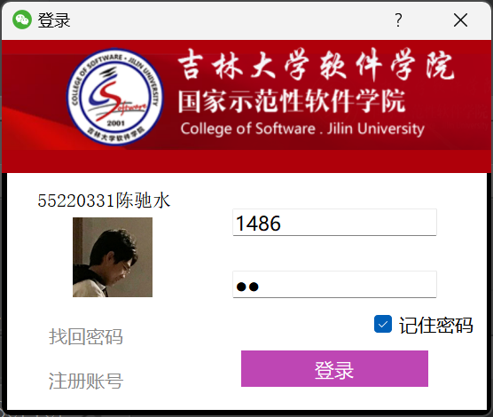
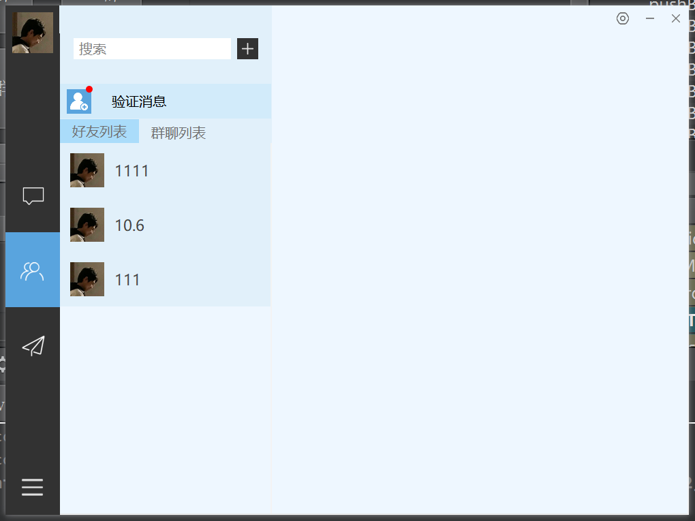
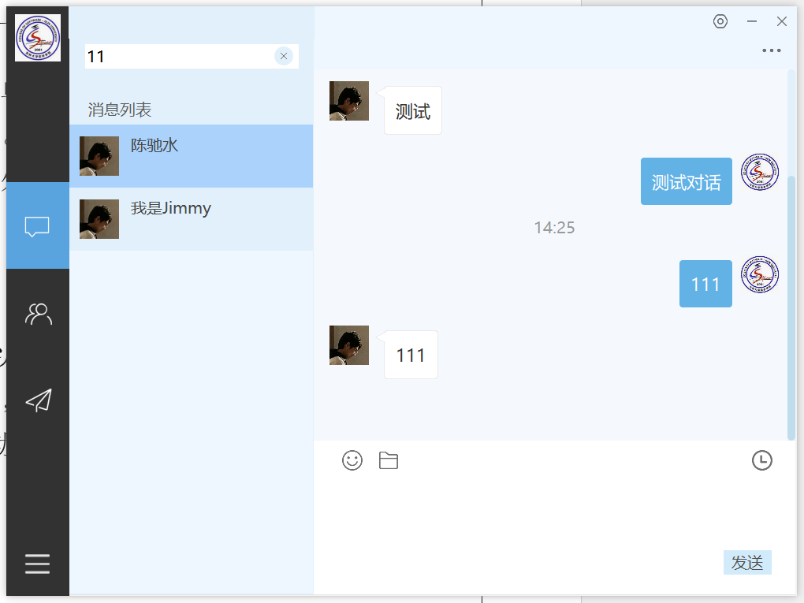
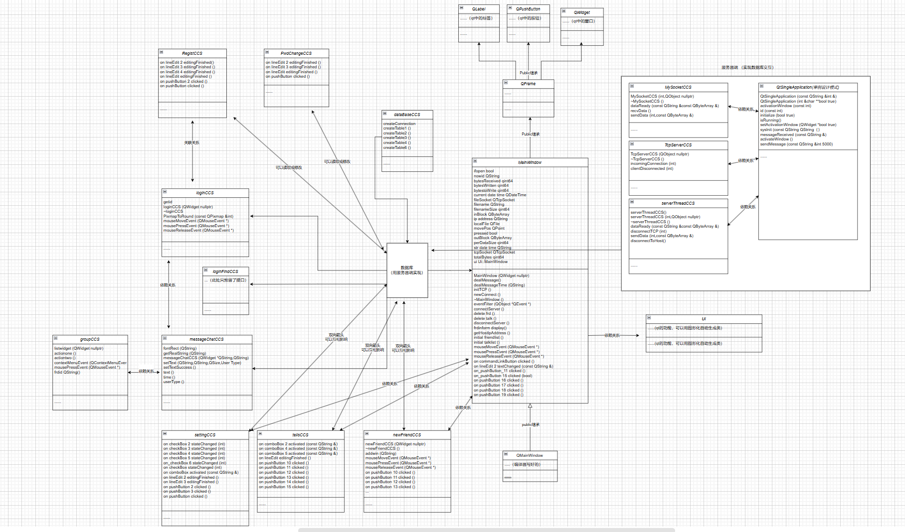

# 模拟即时通信系统

本项目为面向对象程序设计课设，以 OOP 为基础实现即时通讯系统，于 2023 年完成。

项目需求与设计文档在 /doc 中。

## 项目概述

本项目基于面向对象编程范式，设计并实现了一个即时通信系统，支持用户注册、登录、好友管理、消息收发、群聊等功能。项目采用SQLite数据库存储数据，使用Qt图形化套件设计界面，并支持微信和QQ两种风格。

------

## 功能特性

1. **用户管理**
   - 注册、登录、密码修改，支持记住账号功能。
   - 用户信息存储在SQLite数据库中，确保数据安全一致。
1. **好友管理**
   - 添加、删除、修改和查询好友，支持通过ID或昵称搜索。
   - 隐私设置允许用户控制是否被搜索。
1. **聊天功能**
   - 局域网内文本消息收发，支持未读消息和离线消息处理。
   - 群聊功能，支持群成员的添加、移除和管理。
1. **差异化设计**
   - 支持微信和QQ两种风格，差异体现在登录方式和好友搜索规则。
1. **界面与扩展**
   - 使用Qt实现图形化界面，支持多模块切换。
   - 预留接口支持未来扩展功能，如找回密码、文件发送等。

------

### 技术实现

1. **面向对象设计**
   - 基于 QT 5.14.2 版本开发。
   - 使用抽象类、虚函数实现多态和模块化。
1. **数据库与网络通信**
   - 使用SQLite存储用户信息、好友数据、消息记录。
   - 利用TCP协议实现客户端与服务端的双向通信。

---

### 图片预览

